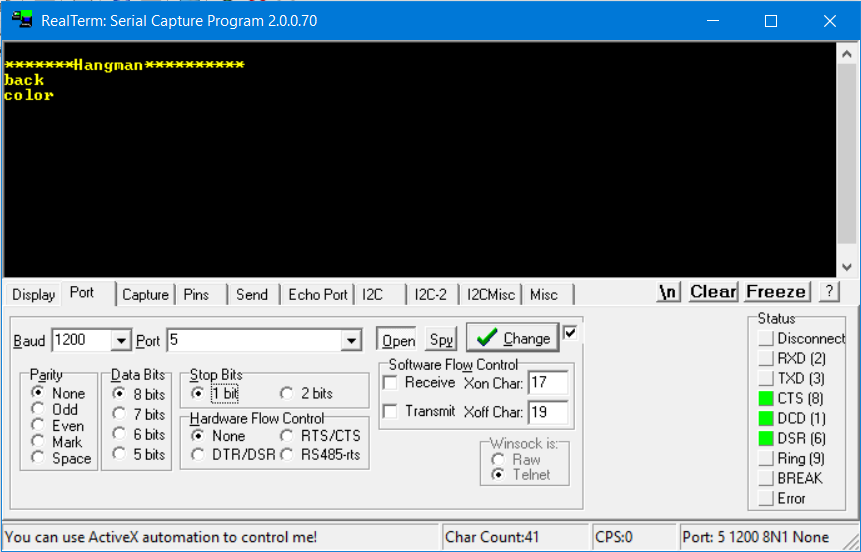

# Hangman Game on 8051 microcontroller
This repository contains the code for playing hangman game on pt-51 microcontroller (EE337 Course Project).

## Requirements

Software
- Keil uvision
- Flip 3.4.7
- Realterm

Hardware
- pt-51 board
- UART module
- LCD
- Jumpers

## Usage
Clone this repository 

```console
> git clone https://github.com/laddhashreya2000/hangman.git
> cd hangman
```
Open the project in Keil and compile it to get a hex file [hangman.hex](Objects/hangman.hex). Burn it on pt-51 microcontroller using Flip software. Interface the UART module with the laptop using Realterm. 

## How to Play

To start the game, press the reset button on the pt-51 development board. You can see the correct word on the Realterm window. Now, while keeping the Realterm window active, use your keyboard to enter any guess letter which will be displayed on LCD. The number of incorrects are displayed on the LCD everytime you make an incorrect guess. You have six chances to guess the correct word. To end the game, simply disconnect your microcontroller from the laptop.




### Code files description

main.c -- Contains the logic of the game

lcd.h -- Contains the functions needed to interface LCD with pt-51

serial.c -- Contains the functions for UART protocol to take keyboard inputs from the laptop

---
<p align="center">Created with ❤️ by <a href="https://laddhashreya2000.github.io" target="_blank">Shreya Laddha</a>
